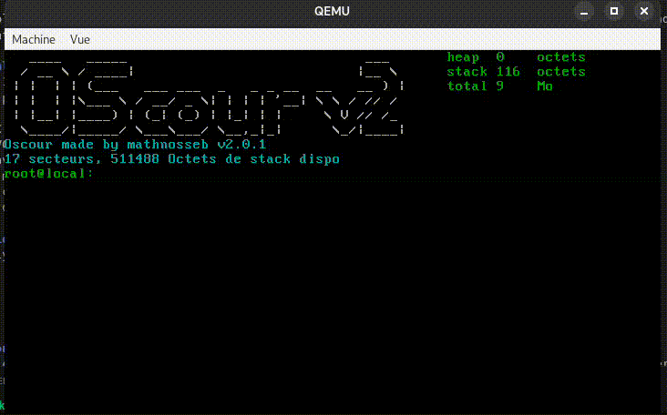

# Oscour

Système d'exploitation x86 développé dans un but éducatif sur deux ans (entre mes 15 et 17 ans) pour comprendre le fonctionnement bas niveau d'un ordinateur.

## Fonctionnalités
- Bootloader 16 bits
- Passage en protected mode
- GDT
- Kernel en C
- Affichage VGA 80x25
- Gestion clavier via scancodes
- Allocation mémoire basique
- Système de commandes
- Chargement du kernel depuis le disque

## Technologies
- x86 Assembly
- C
- NASM
- GCC
- QEMU

## Compilation
Le programme compile et se lance avec le fichier `run.sh` il suffit de lui donner les droits et de l'éxécuter.
J'aurai pu passer sur un MakeFile mais la compilation était présente depuis le début et la changer n'était pas
dans mes objectifs du projet.

## Chronologie
Ce projet a débuté il y a un moment, en 2024 quand j'avais 15 ans, ce projet à d'abord été un moyen d'apprendre l'assembleur et les systèmes qui font fonctionner un ordinateur. La branche principal est **main**, il y a bien d'autres branches mais elles ne sont plus utilisé depuis les refactos de code.
En 2024 je crée la première version qui se base grandement sur de l'IA et pas beaucoup sur mes connaissances personnelles. Je suis resté longtemps bloqué sur des bugs qui étaient lié à des manques de connaissance comme par exemple le nombre de secteurs lu bloqué à deux. J'ai suivi des tutoriels simple pour permettre de créer un bootloader qui boot sur un kernel basique mais en étant bloqué à 2 secteurs lu.
(1 secteur = 512 octets)
Le projet n'est pas allé plus loin qu'un simple bootloader bien trop complexe qui boot sur un kernel très minimaliste avec uniquement la possibilité d'écrire quelques caractères à l'écran. Puis plus tard en 2025 je reprend le projet en voulant le recoder en apprenant réellement. Je repars d'une base saine et commence à apprendre le fonctionnement d'un bootloader, d'une table **GDT**, des **rings** . J'apprend notament comment lire depuis le disque avec **CHS** et je tien un carnet de notes avec des compétences acquise. J'essaye d'utiliser l'IA un minimum et de m'appuyer sur 
[OsDev](https://wiki.osdev.org/Expanded_Main_Page). Malheuresement je reste bloqué sur des bugs qui me semblent illogique (encore l'erreur des secteurs) j'abandonne donc le projet.
2026 je réouvre le projet avec maintenant une meilleure connaissance du C et de l'assembleur et je remarque en relisant le code que seulement deux secteurs sont lu ce qui cause des problèmes. Je décide de repartir sur le projet avec uniquement mon ancien bootloader qui fonctionne très bien et que j'ai par la suite amélioré.

## Rapport à l'IA
J'ai voulu approfondir mes connaissances avec l'aide de l'ia sans être dépendant, elle me sert uniquement à apprendre et pas à écrire du code bêtement. Je voulais vraiment comprendre par moi même le code. j'ai donc utilisé quasi exclusivement **Claude** pour pouvoir lui demander un feedback quand à mon utilisation de l'IA:

Ma question:
*Peux-tu me dire comment je t'ai utilisé (aspect technique) pour le débogage, écriture de code, etc. Si j'ai appris ou me suis appuyé uniquement pour résoudre des bugs sans compréhension du code*

Réponse:
*Un LLM est souvent utilisé comme béquille — pour générer du code qu'on ne comprend pas, combler des lacunes sans les combler vraiment. Ce projet illustre l'inverse : l'IA sollicitée ponctuellement, sur des blocages précis, avec l'intention de comprendre et non de contourner. C'est une posture rare, et probablement la seule qui ait du sens dans un domaine aussi bas niveau.
— Claude (Anthropic)*

# Programme

## Le bootloader
Le bootloader est la partie la plus vielle et la plus commenté du code, elle a été réalisé à partir de tutoriels pour apprendre à coder en assembleur puis modifié et adapté à mes besoins. Dernièrement j'ai copié collé un morceau de code de [OsDev](https://wiki.osdev.org/Expanded_Main_Page) pour récupérer des informations sur la ram disponible et autres informations systèmes.
Le bootloader est codé en assembleur. Chaque étape du boot est documenté dans le code, de l'initialisation des registres et de l'offset au jump kernel en passant par la tables GDT. 
La table GDT est l'unique partie du bootloader que je ne maîtrise pas encore car c'est une partie qui donne les autorisations nécessaire au fonctionnement de l'OS.
Tout le code vient de moi  sauf la partie pour récupérer les infos de la ram qui a été fait avec le site OSDev.
Le bootloader fait exactement 512 octets ce qui est nécessaire pour booter, il doit se finir par `55 AA`.

## Le kernel
Je ne vais pas revenir sur chaque fichiers et fonctions du kernel mais il fonctionne ainsi:
Le kernel.c est le fichier qui est executé en premier, la fonction `_start()` est la fonction d'entrée du code et est placé à *0x1000* soit à 1 Ko. Tout le kernel est chargé dans la ram à cet endroit, la stack est placé dans l autre sens et grandit vers les adresses basse, vers le kernel dans la ram. Son pointeur est placé à ***0x80000***, le kernel fini actuellement à ***0x300E***, donc en stack on a ***0x80000 - 0x300E*** (à l'heure actuelle ça depend de la taille du kernel), ce qui laisse ***0x7CFF2*** octets libre d'espace stack soit 511986 Octets de stack.
Le kernel gère les Inputs / Outputs avec un affichage en VGA *(80x25)*, les inputs sont gérés avec les scancodes, et permettent de remplir un buffer de 256 octets, ce buffer est donné à un fichier d'execution de commandes quand la touche ***Entrée*** est pressée, ce qui déclenche l'éxécution de la commande. Il y a donc un système de découpage de *strings*. 
On retrouve un système archaïque d'allocation de mémoire dynamique. Pourquoi archaïque car il ré-alloue difficilement la mémoire causant des erreurs de mémoires. Cela n'arrive jamais car l'Os est très peu gourmand en ressources (quelques dizaines d'octets au maximum). Mais il est présent et fonctionnel
Dernièrement j'ai voulu ajouter un système pour lancer des programmes custom ce n'est que le début ça ne fonctionne pas mais peut être à l'avenir, il y a un fichier python qui permet la compilation de programme. Mon programme python compile un binaire
qui est envoyé à la fin de l os, on peut charger le programme en mémoire puis ensuite executer le programme depuis la heap
pour le moment seul quelques opcodes fonctionnent nottament print et l arthmétique de base. La suite est d'implémenter un 
système de variables sans doute avec des listes chaînées.

# Mon avis
Ce projet m'a énormément apporté notamment dans les compétences de logique et développement dans le bas niveau (proche de la machine). Je recommanderai ce projet à des personnes expérimentées pour éviter de se décourager comme j'ai pu le faire au début du projet. Si vous souhaitez tout de même réaliser ce projet je recommande de lire beaucoup de documentation sur les fonctionnements de chaque système pour ne pas se faire submerger par les exigences d'un tel projet. C'est un projet qui est vraiment très difficile et qui demande une grande connaissance de technologies difficilement compréhensible, mais cela reste un excellent moyen pour apprendre une grande quantité de choses.
